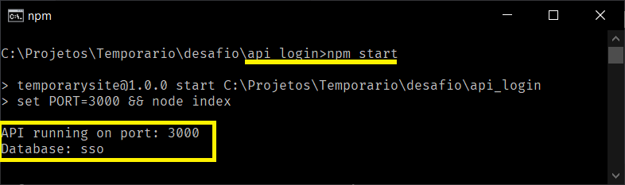
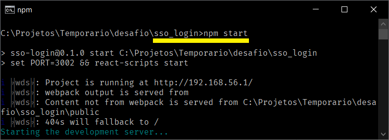

# Single Sign On - SSO

## Requisitos

- Nodejs
- Reactjs
- Yarn
- Navegador (Firefox, Chrome)

## Sumário

1. Projeto.
2. Pastas.
3. Link Http.
4. Tecnologia.
5. Instalações.
6. Instalação pacotes.
7. Execução.

## 1. Projeto

Single Sign On é um mescanismo de login que possibilita a autenticação do usuário para navegação em vários canais.
Este desafio foi criado respeitando os seguintes critérios.

- Implemente uma única feature, a de criação de contas de usuário, ...
- Deve existir uma interface de interação para utilização da feature....
- Durante o preenchimento dos campos o usuário deve apresentar um endereço válido,...

As demais implementações como login, autenticação, ... são plus para entrega do desafio.

## 2. Pastas

O desafio esta divido em duas pastas:

| **App**  | **Pasta** |
| -------- | --------- |
| Backend  | api_login |
| Frontend | sso_login |

## 3. Link http

O desafio está disponibilizado temporariamente no link:
<http://sso-login-com-br.umbler.net/> .
Basta acessar e realizar o cadastro, login e navegação .

## 4. Tecnologias

| **App**  | **Linguagem** |
| -------- | ------------- |
| Backend  | Nodejs        |
| Frontend | ReactJs       |
| Banco    | MongoDB       |

## 5. Instalações

### 5.1 - NodeJs

Versão LTS: 12.18.3.
Link para instalação do node: <https://nodejs.org/dist/v12.18.3/node-v12.18.3-x64.msi>

- Realizar a instalação do programa Nodejs.
- Verificar se foi instalado usando linha de comando.

```sh
node -v
```

Se tudo estiver ok, o número da versão instalada será exibido.

### 5.2 - Yarn

Yarn é um gerenciador de pacotes semelhante o NPM.

- Na linha de comando digite.

```sh
npm install -g yarn

```

### 5.3 - ReactJs

- Na linha de comando digite.

```sh
npm install -g create-react-app
```

## 6. Instalação de pacotes

Como o programa está divido em duas aplicações, será necessário realizar a instalação de cada pacote separadamente.

### 6.1. Pacotes de dependência do **Backend**.

- Na linha de comando digite.

```sh
cd api_login
    npm install
```


- Após a execução do comando uma pasta node_modules será criada dentro da pasta **api_login** com todas as dependências necessárias.

### 6.2. Pacotes de dependência do **Frontend**.

- Na linha de comando

```sh
cd sso_login
    yarn install
```


- Após a execução do comando uma pasta node_modules será criada dentro da pasta **sso_login** com todas as dependências necessárias.

## 7. Execução

### 7.1. Execução do Backend

- Na linha de comando

```sh
cd api_login
    npm start
```



As mensagens de porta e banco serão exibidas.

### 7.2. Execução do Frontend

- Na linha de comando

```sh
cd sso_login
    npm start
```



- Uma aba do navegador será aberta com a aplicação em execução.
